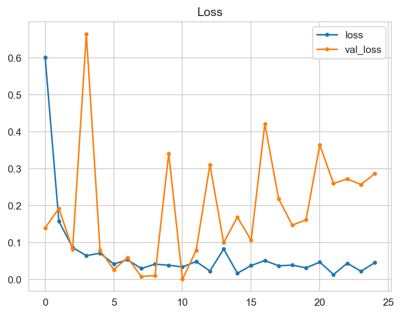

# Mildew Detection in Cherry Leaves

This repo contains a machine learning project aiming to solve a fictional business case where a cherry plantation is affected by a powdery mildew infestation. 

The machine learning model is trained on healthy and diseased images of cherry leaves and the main goal is to predict wether any given new image of a cherry leaf is healthy or diseased. 

Here is a link to the dashboard: 

## Table of Contents - [Mildew Detection in Cherry Leaves](#mildew-detection-in-cherry-leaves)
- [Mildew Detection in Cherry Leaves](#mildew-detection-in-cherry-leaves)
  - [Table of Contents - Mildew Detection in Cherry Leaves](#table-of-contents---mildew-detection-in-cherry-leaves)
  - [CRISP-DM](#crisp-dm)
  - [Business Understanding](#business-understanding)
  - [Dataset Content](#dataset-content)
  - [Hypothesis and how to validate?](#hypothesis-and-how-to-validate)
  - [The rationale to map the business requirements to the Data Visualisations and ML tasks](#the-rationale-to-map-the-business-requirements-to-the-data-visualisations-and-ml-tasks)
  - [ML Business Case](#ml-business-case)
    - [Powdery Mildew Detector](#powdery-mildew-detector)
    - [Rationale for the Model](#rationale-for-the-model)
      - [Description of the model](#description-of-the-model)
      - [Process of creating the model](#process-of-creating-the-model)
      - [Some considerations on the hyperparameters](#some-considerations-on-the-hyperparameters)
  - [Dashboard Design](#dashboard-design)
  - [Unfixed Bugs](#unfixed-bugs)
  - [Deployment](#deployment)
    - [Heroku](#heroku)
  - [Technologies, Languages and Packages](#technologies-languages-and-packages)
    - [Technologies](#technologies)
    - [Languages](#languages)
    - [Main Data Analysis and Machine Learning Libraries](#main-data-analysis-and-machine-learning-libraries)
  - [Credits](#credits)
    - [Code](#code)
    - [Content](#content)

## CRISP-DM 

Doing the project, I made use of the CRISP-DM (Cross Industry Standard Process for Data Mining) workflow commonly used for data science projects. 

The workflow consists of six phases.

1. Business Understanding
   1. What are the business requirements?
   2. What problem does the business hope to solve with the model?
   3. What kind of output does the business require (Dashboard or API)?
2. Data Understanding
   1. What kind of data is available?
   2. Is there sufficient data or do we need to collect more?
3. Data Preparation
   1. Do we need to clean the data?
   2. Do we need to prepare the data in other ways?
4. Modelling
   1. What kind of ML model best suits the task?
   2. Are there other ML models that need to be tried out?
5. Evaluation
   1. If more than one model was trained: which model performs the best?
   2. Does the model fit the requirements?
   3. Can the model be improved?
6. Deployment
   1. Deploy the model in the way that was decided in the Business Understanding phase. 

Each phase may be repeated if new insight is gathered, meaning the phases are not part a straight line, but rather a cycle.  

## Business Understanding

In order to gain proper understanding of the business case presented, the case was assessed by answering 10 questions.

1. What are the business requirements?

The cherry plantation crop from Farmy & Foods is facing a challenge where their cherry plantations have been presenting powdery mildew. Currently, the process is manual verification if a given cherry tree contains powdery mildew. An employee spends around 30 minutes in each tree, taking a few samples of tree leaves and verifying visually if the leaf tree is healthy or has powdery mildew. If there is powdery mildew, the employee applies a specific compound to kill the fungus. The time spent applying this compound is 1 minute.  The company has thousands of cherry trees, located on multiple farms across the country. As a result, this manual process is not scalable due to the time spent in the manual process inspection.

To save time in this process, the IT team suggested an ML system that detects instantly, using a leaf tree image, if it is healthy or has powdery mildew. A similar manual process is in place for other crops for detecting pests, and if this initiative is successful, there is a realistic chance to replicate this project for all other crops. The dataset is a collection of cherry leaf images provided by Farmy & Foods, taken from their crops.

* 1 - The client is interested in conducting a study to visually differentiate a healthy cherry leaf from one with powdery mildew.
* 2 - The client is interested in predicting if a cherry leaf is healthy or contains powdery mildew.

2. Is there any business requirement that can be answered with conventional data analysis?

Yes, conventional data analysis can be used to conduct a study to visually differentiate a healthy leaf from one that contains powdery mildew.

3. Does the client need a dashboard or an API endpoint?

The client requires a dashboard which their employees can access on the plantation to assess the status of any given tree. 

4. What does the client consider as a successful project outcome?

The project is deemed successful when both business requirements are met: 

* A study showing the visual differences between healthy and diseased cherry leaves
* The capability to predict whether a leaf is healthy or contains powdery mildew

5. Can you break down the project into Epics and User Stories?

The project can be broken down into the following Epics:

* Information gathering and data collection.
* Data visualization, cleaning, and preparation.
* Model training, optimization and validation.
* Dashboard planning, designing, and development.
* Dashboard deployment and release.

As you can see, these are almost equivalent to 5 of the 6 phases of the CRISP-DM workflow. 

6. Are there any ethical or privacy concerns?

The client provided the data under an NDA (non-disclosure agreement), therefore the data should only be shared with professionals that are officially involved in the project.

7. Does the data suggest a particular model?

The data suggests a binary classifier, indicating whether a particular cherry leaf is healthy or contains powdery mildew.

8. What are the model's inputs and intended outputs?

The input is an image of a cherry leaf and the output is a prediction of whether the leaf is healthy or contains powdery mildew. 

9. What are the criteria for the performance goal of the predictions?

We agreed with the client a degree of 97% accuracy.

10. How will the client benefit?

The client will be able to tell if a tree is diseased in a much shorter time span that by manually inspecting each tree and can therefore make sure not to supply a product of compromised quality. 

## Dataset Content
* The dataset is sourced from [Kaggle](https://www.kaggle.com/codeinstitute/cherry-leaves). We then created a fictitious user story where predictive analytics can be applied in a real project in the workplace.
* The dataset contains +4 thousand images taken from the client's crop fields. The images show healthy cherry leaves and cherry leaves that have powdery mildew, a fungal disease that affects many plant species. The cherry plantation crop is one of the finest products in their portfolio, and the company is concerned about supplying the market with a compromised quality product.

## Hypothesis and how to validate?
1. Hypothesis: We hypothesize that infected leaves have clear white marks with which they can be distinguished from healthy leaves
    * This can be validated by doing an average image study

2. Hypothesis: We hypothesize that resizing the images to 100 x 100 pixels does not affect the model performance
   * This can be validated by training and fitting two models, once using the original image size and once using the resized images and then comparing the performance metrics of both models

3. Hypothesis: We hypothesize that training and fitting a model on grayscale images does not affect the model performance
   * This can be validated by training and fitting two models, once using the original RGB images and once using grayscale images and then comparing the performance metrics of both models

4. Hypothesis: We hypothesize that a model using the softmax activation function for the output layer performs better than the sigmoid activation function, which is usually chosen for binary classification
   * This can be validated by training and fitting two models, once using the original sigmoig and once using the softmax activation function for the output layer and then comparing the performance metrics of both models

## The rationale to map the business requirements to the Data Visualisations and ML tasks

1. Business Requirement - The client is interested in conducting a study to visually differentiate a healthy cherry leaf from one with powdery mildew.

This leads to the following User Stories:

* As a client I want to have a dashboard so I can easily access the study on visual differentiation between healthy and diseased leaves
* As a client I want to see difference between an average healthy leaf and an average leaf that is affected by powdery mildew so that I can differentiate the leaves
* As a client I want to see an image montage of healthy and affected leaves so I can see the difference between the leaves intuitively

2. Business Requirement - The client is interested in predicting if a cherry leaf is healthy or contains powdery mildew.

This leads to the following User Stories:

* As a client I want to predict whether any leaf is affected by powdery mildew or healthy so that I can quickly say whether a tree is healthy or not
  
The following tasks aim to solve the needs presented in the user stories for Business Requirement 1 and 2:

* Creation of a Streamlit dashboard page containing data visualization and an image study
  * The image study contains average images and variability images for healthy leaves and leaves with powdery mildew
  * The image study contains mean and standard deviation images for both classes
  * The image study contains an image montage for both classes
* Creation of an ML Model (Binary classifier) that can predict whether an image shows a healthy or affected leaf
* Creation of a Streamlit dashboard page containing the ML model predictor
  * There should be an upload section that supports one or multiple images
  * The page should display the prediction result in a clear way

## ML Business Case

### Powdery Mildew Detector

* We want an ML model to predict if a leaf is affected by Powdery Mildew or not, based on the image data contained in the dataset mentioned above. We utilize supervised learning to create a binary classifier with a single label.
* The ideal outcome is a reliable predictor that can speed up the diagnosis of healthy/affected crops on a cherry plantation.
* The success metrics are:
  * Accuracy of 97% on the test set.
* The model output is defined as a flag, showing whether the leaf has powdery mildew or not and the associated probability of the prediction. The plantation workers will upload one or more images in the predictor and the predictor will output the results per image on the fly (not in batches).
* Heuristics: The current method of detecting whether a tree is healthy or not requires an employee to spend around 30 minutes in each tree, taking a few samples of tree leaves and verifying visually if the leaf tree is healthy or has powdery mildew. Since the company has thousands of cherry trees, located on multiple farms across the country, this manual process is not scalable due to the time spent in the manual process inspection. 
* The training data is a [Kaggle dataset](https://www.kaggle.com/codeinstitute/cherry-leaves) with over 4000 images of healthy and affected cherry leaves. 
* The training data is labelled with the target as healthy or containing powdery mildew. The features are all images. 

### Rationale for the Model

#### Description of the model

The model consists of three convolutional layers of which the first is the input layer, a flattening layer and two fully connected layers of which the second is the output layer. 

* Each convolutional layer consists of one Conv2D layer, which is commonly used for 2d images to extract the features by applying convolutional filters, followed by a MaxPooling2D layer, which downsamples feature maps to reduce the dimensions of the image. 
* The flattening layer converts the 2-dimensional features maps into a 1-dimensional vector to prepare for the fully connected layers.
* The fully connected (dense) layers learn higher-level features from the flattened vector. 
  * The first dense layer is followed by a dropout layer, which randomly deactivates neurons during training to prevent overfitting of the model. 
  * The second dense layer is also the output layer, which utilizes the Softmax activation function for multi-class classification. 

The model is compiled using the categorial cross-entropy loss function, the Adagrad optimizer and accuracy as the evaluation metric. 

#### Process of creating the model

To determine the structure of the network and its hyperparameters, I went through a process of training and fitting 11 models with different filters, optimizers, kernel sizes and different parameters for early stopping. While the process I used was not very scientific, I did achieve to get a model that fit the business requirement and predicted reliably. 

The starting point for this trial-and-error process was the model used in the [Malaria Detector Walkthrough](https://github.com/Code-Institute-Org/WalkthroughProject01) project by Code Institute, as well as following common conventions, e.g. keeping the number of filters as a power of two. 

| Model | Model parameter that changed                                | Conclusion                                                                                  | Loss plot | Accuracy plot | Training time/min |
|-------|-------------------------------------------------------------|---------------------------------------------------------------------------------------------|-----------|---------------|-------------------|
| 1     | Model from Walkthrough project                              | The model is underfitting and stopped very early, after only 5 epochs                       ||| 10                |
| 2     | Reduced the filters on Convolutional layers by half         | The model is underfitting, and again stopped very early, after only 5 epochs                     ||| 5                 |
| 3     | Removed early stopping                                      | The model seems to be underfitting                                                          ||| 30                |
| 4     | Changed optimizer to Adadelta                               | The model seems to be overfitting                                                           ||| 39                |
| 5     | Changed optimizer to RMSprop                                | The model is underfitting, there are a lot of spikes in the val_loss plot and the curves are diverging on later epochs ||| 30|
| 6     | Changed optimizer to Adagrad                                | Relatively better fit, but a few spikes remain in both val_loss and val_accuracy              ||| 28                |
| 7     | Reintroducing early stopping at patience 7                  | Training did not stop early, but went through all 25 epochs                                 ||| 26                |
| 8     | Adjusted patience for early stopping to 5                   | Training did not stop early, but went through all 25 epochs                                 ||| 26                |
| 9     | Adjusted patience for early stopping to 3                   | Stopped after 20 epochs                                                                     ||| 20                |
| 10    | Adjusted the filers on Convolutional layers to double again | val_loss and val_accuracy show more spikes again                                               ||| 27                |
| 11    | Changed kernel size from (3, 3) to (2, 2)                   | Shows the nicest progression so far, with a few spikes remaining                               ||| 18                |

Model 11 is what I called the Base model henceforth, which was used to compare the subsequent models from the hypotheses to. It is not a perfect model, and I could have gone on optimizing the different hyperparameters to achieve a better model, however, I eventually decided to stop at this point, since the evaluation also showed that the model performed well enough. 

During the trial and error phase I did not choose to switch the activation function of the output layer, since I wanted to keep this for Hypothesis 4. 

#### Some considerations on the hyperparameters

* Filters
  * It is generally recommended to use numbers for filters on convolutional layers that are a power of two. 
  * Since higher filter numbers lead to higher training times, I did not dare to go above the initial numbers of 32 for the input layer and 64 for the subsequent convolutional layers.
  * I did try to halve the filter number, but eventually went back to the initial number of filters on my layers. I did not try to change the number of filters on individual layers.

* Kernel size
  * The starting point for my kernel size was the model from the Malaria walkthrough, as mentioned above. 
  * Since higher kernel size leads to higher training times, I did keep the kernel size, and only reduced it in the last trial.
  * Towards the end of my project, I read [an article](https://medium.com/analytics-vidhya/how-to-choose-the-size-of-the-convolution-filter-or-kernel-size-for-cnn-86a55a1e2d15) that stated that even numbers on kernel size are not recommended, but 3x3 is the recommended size. Since the project was almost done at this point and my model does perform well enough, I decided not to go back on my decision.

* Optimizer
  * I tried a few different optimizers from the Keras documentation and decided that Adagrad had the best performance

* Activation function
  * For the convolutional layers, I used ReLU, which is the most popular activation function for convolutional layers (according to https://builtin.com/machine-learning/relu-activation-function) and it performed well. I did not see a reason to change it. 
  * For the output layer, I used Sigmoid in the trial and error phase, which is the usual function used for binary classification, which our project is. I did change this to Softmax to check my Hypothesis 4 and saw that it performed slightly better, in that the model trained quicker with the Softmax function. Softmax is an unusual choice here, since it is more commonly used for multi-class classification. The case at hand can be seen as multiclass with two classes though and as we could see, Softmax worked well. 

## Dashboard Design

1. Project Summary
   1. General information
   2. Project Dataset
   3. Link to additional information (README)
   4. Business requirements
2. Leaf Visualizer - This page will answer business requirement 1
    1. Checkbox 1 - Difference between average and variability image
    2. Checkbox 2 - Differences between average affected leaves with powdery mildew and average healthy leaves
    3. Checkbox 3 - Image Montage
3. Powdery Mildew Detector - This page will answer business requirement 2
   1. Link to download a set of sample images for live prediction
   2. User interface with a file uploader widget
      1. User should be able to upload one or more images
      2. The page should display each image and a prediction statement indicating whether the leaf is healthy or has powdery mildew
      3. Show the probability of the prediction
      4. Table containing the image name and the prediction per image including the probability
      5. Download link for the tabular report
4. Project Hypotheses
   1. Block for each project hypothesis, describe the conclusion and how you validated it.
5. ML Performance
   1. Label Frequencies plot for Train, Validation and Test Sets
   2. Model History - Accuracy and Losses
   3. Model evaluation result

## Unfixed Bugs

* At the moment of deployment, there were no known unfixed bugs. 

## Deployment
### Heroku

* The App live link is: https://cherry-mildew-detector-bb62e8fa96ca.herokuapp.com/
* Set the runtime.txt Python version to a [Heroku-20](https://devcenter.heroku.com/articles/python-support#supported-runtimes) stack currently supported version.
* The project was deployed to Heroku using the following steps.

1. Log in to Heroku and create an App
2. At the Deploy tab, select GitHub as the deployment method.
3. Select your repository name and click Search. Once it is found, click Connect.
4. Select the branch you want to deploy, then click Deploy Branch.
5. The deployment process should happen smoothly if all deployment files are fully functional. Click now the button Open App on the top of the page to access your App.
6. If the slug size is too large then add large files not required for the app to the .slugignore file. 

## Technologies, Languages and Packages

### Technologies 

* GitHub to store the repository and project files
* Git as a version control system
* Heroku to deploy and host the project
* Kaggle to source the dataset
* VS Code as local IDE
* Jupyter Notebooks to conduct data collection, preparation and creation of the model

### Languages

* Python 3.8

### Main Data Analysis and Machine Learning Libraries

* Numpy
  * Used for performing numerous array operations
  * Example: converting images into numpy arrays
* Pandas
  * Used for dataframe processing
  * Example: Collect the model history in a dataframe
* Matplotlib
  * Used for data visualization
  * Example: Used to plot accuracy/loss plots
* Seaborn
  * Used for data visualization
  * Example: Used to create the bar plot showing the labels distribution
* Plotly
  * Used for data visualization
  * Example: Used to create the bar plot on the Powdery Mildew Detection dashboard page showing the prediction probability
* Streamlit
  * Used for dashboard creation
  * Example: Used to create the dashboard that is deployed to heroku
* Tensorflow-cpu
  * Used for modelling
  * Example: Used for creating the CNN pipeline
* Joblib
  * Used for file operations
  * Example: Used to save data in different file formats, e.g. class_indices.pkl
* Keras
  * Used for modelling
  * Example: Used for the hyperparameters, but also for image augmentation 
* PIL
  * Used for image operations
  * Example: Image class used to resize input on the Powdery Mildew Detection dashboard page

## Credits 

### Code

* The [Malaria Detector Walkthrough](https://github.com/Code-Institute-Org/WalkthroughProject01) was used as a guidance for this project in many parts, and many code snippets were adapted from there and are credited in the code and notebooks as well. 
* Other than that, the lesson material on Tensorflow and image analysis was referenced throughout the project. 

### Content

* [What is CRISP-DM](https://www.datascience-pm.com/crisp-dm-2/) - Further reading on CRISP-DM, referenced to understand the concept and to write the Readme section
